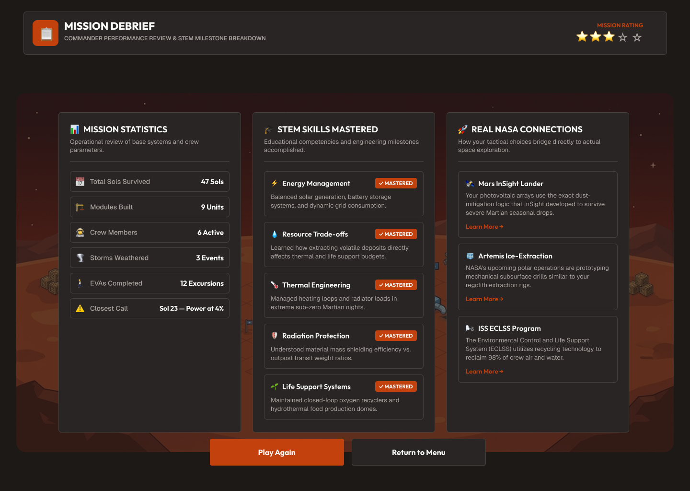
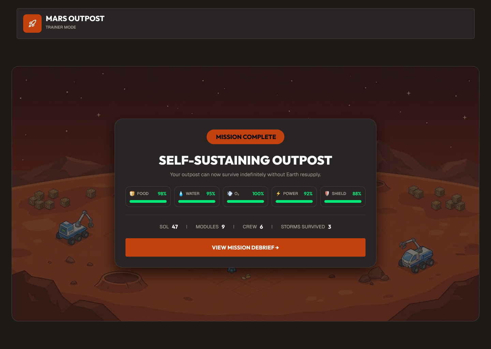

# 🚀 Mars Horizon — Junior Astronaut Mission Trainer

<p align="center">
  
</p>

[](https://github.com/Theteamakrasia/Mars-Horizon-Junior-Astronaut-Mission-Trainer/actions/workflows/ci.yml)
[](https://github.com/Theteamakrasia/Mars-Horizon-Junior-Astronaut-Mission-Trainer/actions/workflows/deploy.yml)
[](https://www.typescriptlang.org/)
[](https://vite.dev/)
[](https://vitest.dev/)
[](LICENSE)

**A space-survival strategy game where kids learn to run a real Martian outpost.**

You are a newly chosen junior astronaut. You have been trained for months, but you have
never actually *been* anywhere. Your rocket has arrived at Mars, and from here on out,
every decision is yours.


Where do you land? How much power do you build? Do you spend your water on the crew or
save it for the greenhouse? When a dust storm is three sols away, what do you fix first?

**There are no enemies. The hardest thing you'll fight is a resource budget.**

| | |
| --- | --- |
| 🏆 **Event** | [2026 NASA Space Apps Challenge](https://www.spaceappschallenge.org/) — November 14–15, 2026 |
| 📚 **Subjects** | Space Exploration, Games, Planets & Moons, Software, The Sun |
| 🎯 **Difficulty** | Beginner / Youth · Intermediate |
| 👦 **Audience** | Ages ~8–16, families, classrooms |
| 🛠 **Status** | Design & prototype stage |

> **Attribution.** This project is a student entry in the 2026 NASA Space Apps Challenge.
> It is **not** produced, endorsed, or operated by NASA. NASA, the NASA insignia, and the
> Space Apps Challenge name are trademarks of the National Aeronautics and Space Administration,
> used here only to identify the challenge this project responds to and to credit NASA as
> the source of the open data it is built on.

---

## Index

- [What Is This Game?](#what-is-this-game)
  - [The Design Promise](#the-design-promise)
- [The Challenge We're Answering](#the-challenge-were-answering)
- [Your Mission](#your-mission)
  - [The Ten Missions](#the-ten-missions)
- [Gameplay Walkthrough](#gameplay-walkthrough)
  - [Choose Your Landing Site](#choose-your-landing-site)
  - [Establish Your Base](#establish-your-base)
  - [Plan Phase — Read the Situation](#plan-phase-read-the-situation)
  - [Act Phase — Make Your Move](#act-phase-make-your-move)
  - [Debrief — Learn From What Happened](#debrief-learn-from-what-happened)
  - [Final — A Self-Sustaining Outpost](#final-a-self-sustaining-outpost)
- [What You Learn](#what-you-learn)
  - [The Science Is Real](#the-science-is-real)
  - [On the International Space Station](#on-the-international-space-station)
- [Why This Matters for Earth](#why-this-matters-for-earth)
- [NASA Data Sources](#nasa-data-sources)
- [Kid-Friendly by Design](#kid-friendly-by-design)
- [Project Status](#project-status)
- [Screenshot Index](#screenshot-index)
- [Keep Exploring](#keep-exploring)

---

<a id="what-is-this-game"></a>
## 🎮 What Is This Game?

**Mars Horizon** is an interactive simulation where you manage a small research outpost on
the surface of Mars. Instead of fighting monsters or collecting coins, you balance
competing demands — the exact same kind of trade-offs real NASA engineers face every day.

You manage five things that never stop draining:

| Resource | Why It Runs Out |
| --- | --- |
| ⚡ **Power** | Your solar panels only work in daylight. Night is coming. |
| 🫁 **Oxygen (O₂)** | You breathe it out and it never comes back on its own. |
| 💧 **Water** | You need it to drink, to grow food, and to make more water. |
| 🍞 **Food** | Growing it takes water, power, and time. |
| 🛡️ **Radiation Shielding** | Mars has no global magnetic field to protect you. |

Every choice you make improves one of those and costs you another. That's the whole game —
and it's also the whole job.

<a id="the-design-promise"></a>
### The Design Promise

Most space games fall into one of two traps:

- ❌ **Too simple.** "Collect the shiny rocks, build the base, win." No real thinking required.
- ❌ **Too complicated.** A wall of engineering jargon and 400 buttons that turns a kid off.

Mars Horizon aims for the narrow path between them: **scientifically honest, but built so a
child can understand it without a manual.** No violence, no fantasy creatures, no magic.
Just engineering — the real kind, made playable.

---

<a id="the-challenge-were-answering"></a>
## 🧩 The Challenge We're Answering

The 2026 Space Apps brief identifies a real gap:

> Space-themed STEM content often oversimplifies the engineering trade-offs that define a
> real mission, or presents them at a level too complex to hold a young learner's attention.
> Few tools make those trade-offs both tangible and fun.

Your challenge is to design and build an interactive game or app that lets students run a
lunar or Martian outpost — balancing competing demands like life support, radiation
shielding, power, and food production — so they experience firsthand the decisions that
determine whether a mission fails or succeeds.

**Our answer:** a survival-strategy loop where the trade-offs *are* the gameplay. You cannot
win by hoarding one resource, because every action you take is paid for in another. Players
who succeed do it by thinking like engineers — building margin before they need it.

---

<a id="your-mission"></a>
## 🗺 Your Mission

From rocket touchdown to a self-sustaining outpost, the game follows one clear arc:

```
🚀 MARS ARRIVAL
      ↓
🗺  CHOOSE YOUR REGION          ← your first real decision
      ↓
🛬 LANDING
      ↓
🏠 ESTABLISH YOUR BASE
      ↓
🔄 THE SURVIVAL LOOP            ← power · O₂ · water · food · radiation · maintenance
      ↓
📋 TEN MISSIONS                 ← the outpost grows in stages
      ↓
🏠 SELF-SUSTAINING OUTPOST
      ↓
📝 DEBRIEF                     ← what worked, what didn't, and why
```

<a id="the-ten-missions"></a>
### The Ten Missions

| # | Mission | What you're learning |
| --- | --- | --- |
| 1 | **Establish Outpost** | Basic infrastructure and why nothing works without power |
| 2 | **Survey Environment** | Reading real site data before you commit to it |
| 3 | **Robotic Operations** | Why rovers are safer and cheaper than people for routine jobs |
| 4 | **First EVA** | Spacewalks: suit limits, airlock cycles, and time pressure |
| 5 | **Find Resources** | Locating what you need instead of shipping it from Earth |
| 6 | **ISRU** *(In-Situ Resource Utilization)* | Turning local dirt and ice into usable supplies |
| 7 | **First Harvest** | Closing the loop — food you grow is food you don't launch |
| 8 | **Science Expedition** | Why research is the entire point of the mission |
| 9 | **Survive Major Hazard** | A real dust storm. Everything you prepared for gets tested. |
| 10 | **Expand the Outpost** | Growth without losing stability |

> **ISRU** is the big one for curious players. It stands for *In-Situ Resource Utilization* —
> using materials found where you are instead of shipping them from Earth. On a real Mars
> mission, this is the difference between a base that can survive and one that eventually
> runs dry. It's also the whole reason scientists hunt for water ice under the Martian surface.

---

<a id="gameplay-walkthrough"></a>
## 🎬 Gameplay Walkthrough

Every screenshot below is a real screen from the game, placed in the order you'll meet it.

<a id="choose-your-landing-site"></a>
### 1. Choose Your Landing Site

Your rocket is in orbit. Five regions are marked on the map — and **there is no perfect
choice.** Each one is strong in some ways and dangerous in others.


The **Site Analysis** panel scores the region you have selected across five axes, out of 5 each:

| Axis | What it means for you |
| --- | --- |
| 💧 **Water** | Is there ice nearby? Can you make your own? |
| ☀️ **Sun** | How much power will your solar panels actually get? |
| ⛰️ **Terrain** | Flat and safe, or steep and hard to build on? |
| 🌪️ **Dust** | Will storms bury your equipment? |
| 🌡️ **Temp** | How much energy will you burn just staying warm? |

**The lesson:** a site with perfect water and terrible sun will kill you just as surely as
one with great sun and no water. Real landing-site selection is exactly this — NASA picked
Jezero Crater not because it's the *best* place, but because its combination of ancient
river deposits and workable terrain makes it the most **interesting** place to explore.

<a id="establish-your-base"></a>
### 2. Establish Your Base

You touch down and lay out your first modules: habitat, life support, solar array, and
batteries. This screen is your home base for the whole run.


Notice the **warning at the bottom right**: *solar storm approaching in sol 2.* You just
landed, and you already have a problem. That warning is the game teaching you to read ahead.

The button at the bottom — **Build New Module** — is the core of the whole strategy layer.
Every module you add improves one system and increases what every other system has to support.

<a id="plan-phase-read-the-situation"></a>
### 3. Plan Phase — Read the Situation

At the start of each sol you get a planning screen. Nothing is decided yet. This is where
you look at what's coming and choose what to do about it.


This is the heart of the game, and it teaches four ideas at once:

- **Forecast before you act.** A storm on Sol 28 means you have 28 sols to prepare. Players who
  wait until Sol 28 are already too late.
- **Everything is finite.** You can see exactly how much of everything you have left.
- **The crew is people, not numbers.** Dr. Chen is a botanist growing food. Cmdr. Kelly is
  running maintenance. Assign them where they're actually needed.
- **You get deliveries, but you can't count on them.** A supply pod arriving on Sol 30 is a
  *scheduled* event. Survive until it lands and you can breathe again.

<a id="act-phase-make-your-move"></a>
### 4. Act Phase — Make Your Move

Now you commit. This is where a good plan meets a real constraint.


This mission explains the single most important idea in the game, using a picture instead
of a paragraph:

> ☀️ Sun → 📡 Arrays → **+45 kW/h** → 🔋 Storing 12 kW/h → 🌙 **−30 kW/h night drain**

You have **excellent sunlight** and you still can't win, because Mars night lasts about
12 hours and your panels make nothing the whole time. The 45 kW you collect by day has to
survive a night that costs 30 kW — *and* charge the batteries to get you through the next
night, *and* power the life support, the greenhouse, and everything else.

That's not a made-up puzzle. It's the exact reason NASA's rovers and habitats rely heavily
on **nuclear power** rather than solar alone. The trade-off is real, and the game makes a
child feel it.

<a id="debrief-learn-from-what-happened"></a>
### 5. Debrief — Learn From What Happened



The debrief is where the learning actually lands. You see:

- What you **used** and what you **wasted**
- Which problems you solved early and which ones caught you
- The **real science** behind whatever went wrong

A run that ends badly is the most educational run in the game.

<a id="final-a-self-sustaining-outpost"></a>
### 6. Final — A Self-Sustaining Outpost



You win by reaching a place where the outpost genuinely runs itself: food is grown on site,
water is recycled, power is balanced day and night, and the crew needs nothing shipped from
Earth.

<a id="what-you-learn"></a>
## 🎓 What You Learn

Playing Mars Horizon is really a systems-thinking lesson wearing a spacesuit. Here's what
a player takes away without ever being told a lesson:

| Skill | How the game teaches it |
| --- | --- |
| **Trade-off thinking** | No action is free. Every fix costs a different resource, so there's never one right answer |
| **Systems thinking** | Changing one thing ripples through everything else — more modules means more power draw *and* more oxygen to recycle |
| **Energy balance** | Day/night cycles, storage capacity, and the gap between generating and surviving until sunrise |
| **Closed-loop living** | Recycling water, regenerating air, and growing food instead of resupplying — the core of real off-world life support |
| **Reading data** | Weather radar, resource stores, and forecasts are how you make decisions, not decoration |
| **Preparation & margin** | Winners build reserves *before* the crisis. This is a life skill, not just a game one |
| **Reading real NASA data** | Site conditions and space weather come from actual NASA sources, not made-up numbers |
| **Second attempts** | Losing teaches more than winning, because the debrief explains exactly *why* |

<a id="the-science-is-real"></a>
### The Science Is Real

We don't invent numbers when we don't have to. A few things the game models, straight from
NASA:

- **A day on Mars is called a *sol***, and it's about **39 minutes and 35 seconds longer** than
  an Earth day. Every schedule in the game is counted in sols for this reason.
- **Mars has no global magnetic field today.** Earth's field deflects charged particles from
  the Sun; Mars has nothing, which is why radiation shielding is a permanent, ongoing cost.
  (Ironically, leftover traces of an ancient magnetic field *are* preserved in Mars's
  southern crust — one of the planet's most interesting puzzles.)
- **The Martian atmosphere is mostly carbon dioxide**, with nitrogen and argon making up the
  rest, and it's so thin that heat escapes easily. Surface temperatures swing from about
  **−153 °C to 20 °C**. That thin air is also why the sky looks red — it's suspended dust,
  not a blue sky like ours.
- **Water exists on Mars today**, but not as liquid. It's locked as ice beneath the polar
  surface, plus salty brines that flow seasonally down hillsides. Finding and using it is the
  whole game.
- **Space storms are real and tracked.** Solar flares and coronal mass ejections are monitored
  by NASA every day — that's what DONKI does.

<a id="on-the-international-space-station"></a>
### On the International Space Station

The systems in this game aren't sci-fi. The ISS has been quietly proving them out for
decades. NASA's **Environmental Control and Life Support System (ECLSS)** does exactly what
our game asks you to simulate: it controls air pressure, oxygen levels, ventilation, waste
management and water supply. It has three main parts:

- **Water Recovery System** — cleans wastewater, humidity and even water from spacesuits,
  currently recycling roughly **90% of the water on station**
- **Air Revitalization System** — scrubs carbon dioxide and other trace contaminants out of
  the air you breathe
- **Oxygen Generation System** — splits water into oxygen and hydrogen by electrolysis

Astronauts are, on a small scale, playing our game every single day. The difference is NASA
gets to cheat with resupply ships. On Mars, you can't.

---

<a id="why-this-matters-for-earth"></a>
## 🌍 Why This Matters for Earth

It's easy to think of a Mars outpost game as pure entertainment. It isn't. The exact
engineering skills it teaches are the ones we're going to need long before anyone sets foot
on Mars.

**We're already running out of things to take for granted.** Fresh water, clean air, and
reliable power are becoming the defining global challenges of this century — and the
"closed-loop living" mechanic in this game is a simplified model of exactly the closed-loop
systems environmental engineers are trying to build *here*. Learning to waste less is a
planetary-scale habit, and Mars is a good place to practise it.

**Climate and space weather share a root cause.** The same solar activity that powers the
coronal mass ejections in our game's weather radar also drives the auroras on Earth — and
can disrupt satellites, GPS, radio and power grids. Understanding that the Sun matters to
both planets is a genuinely important idea.

**Perseverance proved we can look for ancient life.** NASA's Mars 2020 rover landed in Jezero
Crater — one of the landing sites in our game — specifically because it's an ancient river
delta that may have once held liquid water and, possibly, life. The science in this game is
the science a real rover is doing right now.

**And the goal is bigger than Mars.** Everything built toward a self-sustaining outpost —
recycling systems, closed-loop food, renewable power, living efficiently on a small
budget — is technology we need on Earth first. Mars is a forcing function that makes us
solve problems we have to solve anyway.

**That is the real goal of a Mars mission**, and it is the hardest engineering problem
humans have ever attempted.

---

<a id="nasa-data-sources"></a>
## 🛰️ NASA Data Sources

Every technical value in this project is grounded in real, publicly available NASA
resources. These are the ones we build on:

| Source | What it gives us |
| --- | --- |
| **[NASA Space Apps Challenge](https://www.spaceappschallenge.org/)** | The challenge brief this project answers. 2026 event: November 14–15, 2026 |
| **[Mars: Facts](https://science.nasa.gov/mars/facts/)** | Atmosphere composition, temperature range, water, and the absence of a global magnetic field |
| **[Telling Time on Mars](https://www.giss.nasa.gov/research/briefs/1998_allison_02/)** (GISS) | Sol length — 24 h 39 m 35.2 s — and why sols are the unit of a Martian schedule |
| **[ECLSS](https://www.nasa.gov/reference/environmental-control-and-life-support-systems-eclss/)** | How real life support works: water recovery (~90% reuse), air revitalization, oxygen generation |
| **[Life Support BVAD](https://ntrs.nasa.gov/citations/20210024855)** *(Baseline Values and Assumptions Document)* | Standard reference values for human life-support needs — the basis for our resource numbers |
| **[DONKI](https://ccmc.gsfc.nasa.gov/tools/DONKI/)** | The Space Weather database tracking solar flares and coronal mass ejections — our in-game storms |
| **[Planetary Data System (PDS)](https://pds.nasa.gov/)** | NASA's long-term archive of planetary mission data, including Mars observations |
| **[NASA Open Data Portal](https://data.nasa.gov/)** | NASA's public catalog of open datasets across science and exploration |
| **[NASA API Portal](https://api.nasa.gov/)** | Direct access to NASA APIs for live data, including imagery and space weather |
| **[NASA Space Place](https://spaceplace.nasa.gov/)** | NASA's kid-facing science site — our reference for tone, reading level and age-appropriateness |

**A note on honesty:** where we don't have a hard number, we tell the player it's an
approximation. Faking precision would teach kids to trust data that isn't real, which is the
exact opposite of what this game is for.

---

<a id="kid-friendly-by-design"></a>
## 👦 Kid-Friendly by Design

This game is built for young players first, and every decision follows from that:

- **No violence.** Nothing shoots at you. Failures cost resources and time, never a life.
- **No fantasy elements.** No aliens, no magic, no monsters. The only enemy is physics.
- **Realistic, but readable.** The science is true; the presentation is a friendly UI with
  emoji markers, plain language and no unexplained jargon.
- **No punishing complexity.** A child can land, survive several sols and understand *why*
  they made the choices they did — without reading a manual.
- **Losing is informative.** There's no game-over screen that just says "you failed." You get a
  debrief explaining the real cause, which is the point.
- **A gentle difficulty curve.** The first missions teach one idea at a time. Complexity is
  added only as the player is ready for it.

---

<a id="project-status"></a>
## 🛠 Project Status

Release and deployment updates are tracked in the [changelog](docs/CHANGELOG.md).

**Mars Horizon is currently in the design and prototype stage.** This repository holds the
project documentation, the game design notes and the UI mockups.

There is no installable build or playable release at this time — when one is ready, this
section will be replaced with setup and run instructions.

```
Mars-Horizon-Junior-Astronaut-Mission-Trainer/
├── README.md
└── Assets/
    └── README_ref/              ← screenshots used in this document
        ├── choose landing.png    ← landing site selection screen
        ├── survival loop.png     ← outpost / base overview screen
        ├── survival loop-1.png   ← plan phase screen
        ├── survival loop-2.png   ← act phase screen
        ├── debrief.png           ← mission debrief screen
        └── Final.png             ← self-sustaining outpost screen
```

---

<a id="screenshot-index"></a>
## 🖼 Screenshot Index

| # | Screen | File | Shown in |
| --- | --- | --- | --- |
| 1 | Landing site selection | [`Assets/README_ref/choose landing.png`](Assets/README_ref/choose%20landing.png) | Walkthrough step 1 |
| 2 | Outpost overview | [`Assets/README_ref/survival loop.png`](Assets/README_ref/survival%20loop.png) | Walkthrough step 2 |
| 3 | Plan phase | [`Assets/README_ref/survival loop-1.png`](Assets/README_ref/survival%20loop-1.png) | Walkthrough step 3 |
| 4 | Act phase | [`Assets/README_ref/survival loop-2.png`](Assets/README_ref/survival%20loop-2.png) | Walkthrough step 4 |
| 5 | Debrief | [`Assets/README_ref/debrief.png`](Assets/README_ref/debrief.png) | Walkthrough step 5 |
| 6 | Self-sustaining outpost | [`Assets/README_ref/Final.png`](Assets/README_ref/Final.png) | Walkthrough step 6 |

---

<a id="keep-exploring"></a>
## 🪐 Keep Exploring

If this game sparks your curiosity, these are genuinely good places to keep going — all
official NASA, all free:

- 🔬 **[NASA Space Place](https://spaceplace.nasa.gov/)** — games, crafts and articles made for kids
- 🚀 **[Mars Exploration](https://science.nasa.gov/mars/)** — the missions, rovers and the real science
- 👨‍🚀 **[NASA Humans in Space](https://www.nasa.gov/humans-in-space/)** — what crews actually do in orbit
- 📅 **[Space Weather](https://www.nasa.gov/space-weather/)** — the storms that power our in-game warnings

---

*Built with curiosity, for curious kids. Good luck out there, astronaut. 🚀*

---
